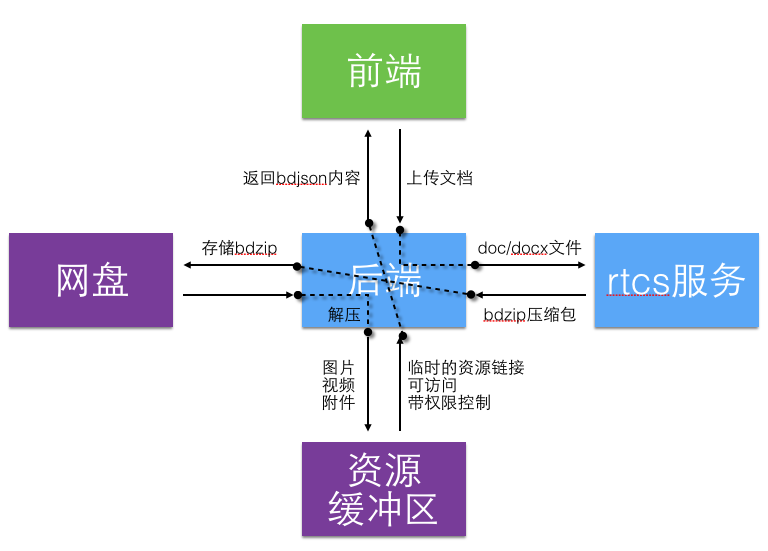

wordonline 前后端对接说明
==========

## 1 背景

wordonline 计划实现一个可以在线编辑文档、管理文档、分享或共享文档的平台，产出类似 `skydrive` 在线word的平台。

这需要用到一些技术和资源，其中 doc/docx 文档解析在文库已有成熟技术，文档存储可以使用网盘个人存储。现有实现 wordonline 的需求，还存在一些难点，一是网盘提供的接口有限，二是文档编辑后保存成 `docx` 的技术尚未成熟。这给 wordonline 的后端带来比较复杂的需求。

## 2 后端支持说明

后端关联到 前端、网盘、rtcs 服务多方的通讯，较为复杂，为了解决各难点带来的问题，下面说明后端的需求。

- 文档最终存储以 **bdzip压缩包** 形式保存，压缩格式待定。
- 文档解压后的资源放在 **缓冲区** ，给前端提供可访问临时带权限控制的临时链接。
- 文档编辑过程和资源操作分离，对于前端来说，文档主要操作是 **对bdjson的读写操作**。

后端给前端提供文档操作，具体分以下几点需求说明：

1. 登录passport
2. 网盘文件常规操作
3. 文档读写内容
4. 分享文件（公开/私密）
5. 共享文档（协同编辑）

## 3 登录passport

网盘文件存取需要百度帐号的登录状态，以第三方的身份登录会多一个步骤，wordonline选择使用百度passport帐号登录，需要提交[申请](http://passport.sys.baidu.com)

## 4 网盘文件常规操作

网盘文件的操作，统一往后端提交请求，后端对请求做代理，返回请求结果给前端。

请求格式参考网盘pcs api [pcs_inner_api](http://wiki.babel.baidu.com/twiki/bin/view/Com/Main/PCS_INNER_API)

代理接口包括以下几个：

1. 列出目录文件
2. 添加文件
3. 删除文件
4. 移动文件（重命名文件）
5. 复制文件

## 5 文档读写内容

wordonline 的文档使用个人云存储，保存在网盘 `/apps/wordonline` 目录下。

文档保存格式一个压缩包，里面bdjson内容和相关资源文件，压缩格式待定。

## 5.1 新增文档

### 5.1.1 上传文档

1. 前端文档提交文档给后端，后端把文档发送到rtcs服务，返回bdzip包。
2. 后端把bdzip包上传到网盘。

### 5.1.2 创建文档

1. 前端编辑内容，编辑过程会上传图片或文件到后端，后端把图片和文件保存在缓冲区，给前端返回一个临时可访问有权限控制的图片链接。
2. 前端文档内容编辑完成，发送bdjson字符串给后端，后端通过bdjson以及里面包含的临时链接（在缓冲区找到对应资源），压缩成bdzip包。

## 5.2 读取文档内容

### 5.2.1 从网盘读取文件

1. 前端列出网盘文件目录后，再通过path向后端请求文档。

2. 后端根据path，向网盘请求获取文件的bdzip内容，解压，把资源文件放到缓冲区，bdjson里的资源文件链接换成缓冲区的临时可访问链接，返回bdjson给前端。

### 5.2.2 上传文件并进入编辑

1. 上传过程按 4.1.1 的流程执行完成之后，再按 4.2.1 第2点返回给前端。

## 6 分享文件

分享文件按照公开程度分为 **公开分享** 和 **私密分享**
按照分享类型分为 **只读分享** 和 **可读写分享（协同编辑）**

分享文件操作，需要把文件备份到一个公共可读的存储空间，可以考虑 Redis 或 bcs，以下以 **公共存储** 指代。

### 6.1 只读分享

1. 文档所有者分享文档，后端备份这个文件到公共存储，给前端一个分享链接，可以在链接上做密码验证，和人数限制等。
2. 其他用户打开分享链接，进入验证，验证通过后，可以阅读当前文档。

### 6.2 可读写分享（协同编辑）

协同编辑的第一期，做成简单的锁文件方式，流程如下：

1. 文档所有者分享文档，后端备份这个文件到公共存储，给前端一个分享链接，可以在链接上做密码验证，和人数限制等。
2. 协同者打开分享链接，进入验证，验证通过后，可以阅读当前文档，也可以修改文档或者添加评论（批注）。
3. 分享的文档默认没有正在编辑者，协同者可以直接进入编辑，这时有第二个协同者想编辑文档需要选择征求正在编辑者的同意，再进入编辑。
